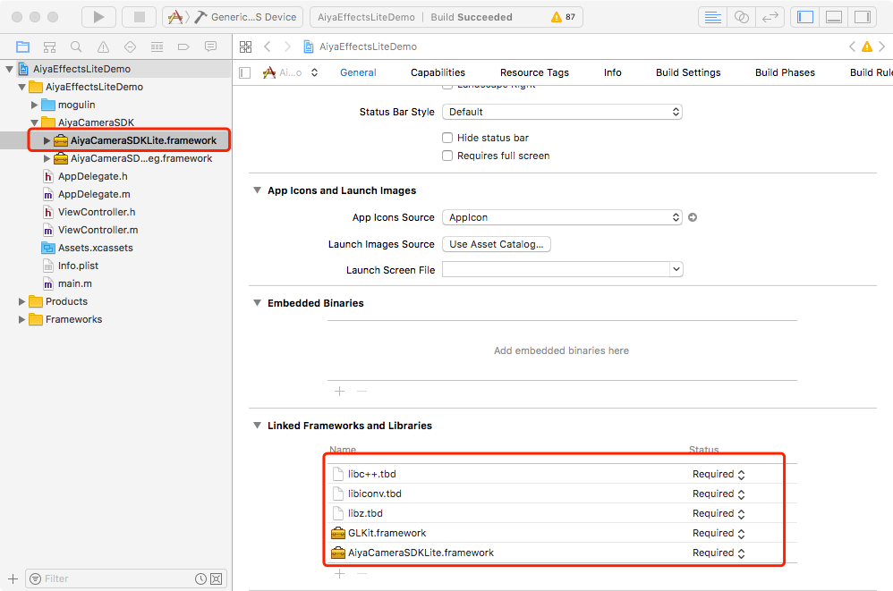
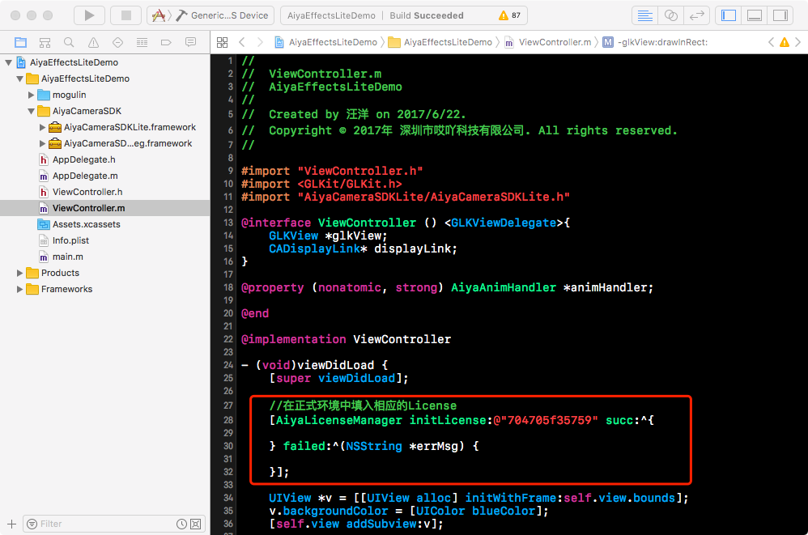
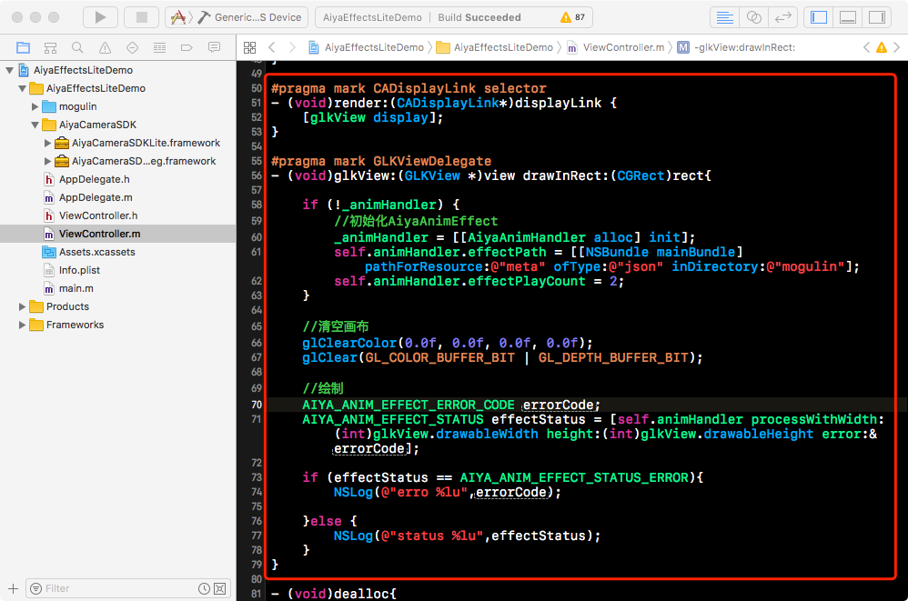

# 宝宝特效 AiyaEffecSDK iOS 精简版快速集成

## Step1 集成framework
将 宝宝特效 AiyaEffectSDK iOS 精简版 解压后， 将 AiyaEfffectsLiteDemo/AiyaEffectSDK 目录拖到项目中.然后添加另外四个系统库:
* libiconv.tdb
* libc++.tdb
* libz.tdb
* GLKit.framework

## Step2 初始化License
在使用AiyaCameraSDKLite之前，必须先初始化license，否则会出现无法使用的情况，申请appKey请访问[宝宝特效 免费使用](http://bbtexiao.aiyaapp.com/site/free)

## Step3 调用

